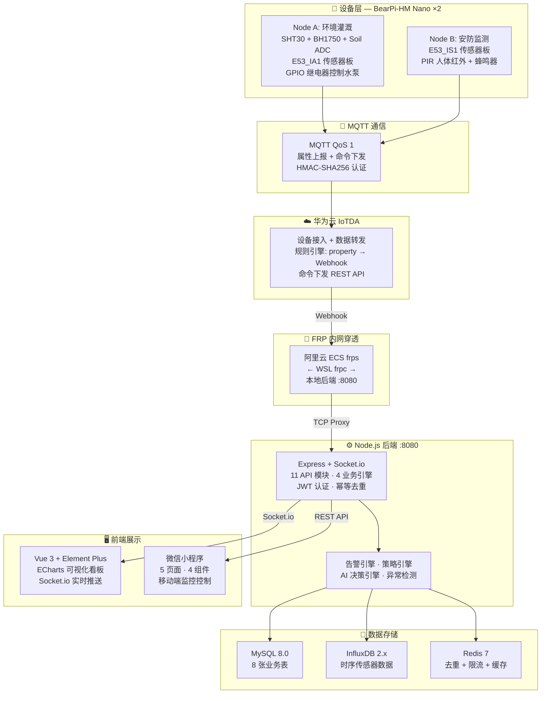
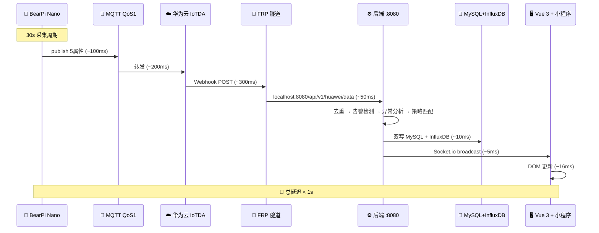

<div align="center">

# 🌾 智慧农业物联网灌溉系统

### Smart Agriculture IoT Irrigation System

[](LICENSE)
[](https://nodejs.org)
[](https://vuejs.org)
[](https://www.huaweicloud.com/product/iotda.html)
[](https://www.bearpi.cn)
[](https://www.influxdata.com)

**端到端 · 全栈 · 物联网**  
从 BearPi-HM Nano 嵌入式传感器 → 华为云 IoTDA → Node.js 后端 → Vue 3 可视化大屏 → 微信小程序  
一套代码，全链路覆盖，开箱即用的智慧农业解决方案。

</div>

---

## 📖 目录

- [系统架构](#-系统架构)
- [全链路数据流](#-全链路数据流)
- [功能矩阵](#-功能矩阵)
- [技术栈](#-技术栈)
- [项目结构](#-项目结构)
- [快速开始](#-快速开始)
- [MQTT 通信设计](#-mqtt-通信设计)
- [微信小程序](#-微信小程序)
- [数据库设计](#-数据库设计)
- [AI 智能决策](#-ai-智能决策)
- [文档索引](#-文档索引)

---

## 🏗️ 系统架构

> GitHub 原生支持 Mermaid 图表渲染，以下架构图可直接查看。



---

## 🔄 全链路数据流

端到端延迟 **< 1 秒**（不含 30s 采集周期）：



---

## ⚡ 功能矩阵

| 模块 | 功能 | Web 端 | 小程序 | 状态 |
|------|------|:------:|:------:|:----:|
| 🌡️ **数据采集** | 土壤湿度/温度、空气温湿度、光照 (30s) | ✅ | ✅ | 完成 |
| 📡 **设备接入** | 华为云 IoTDA 认证 + 数据转发 + Webhook | ✅ | — | 完成 |
| 📊 **实时看板** | Socket.io 推送，传感器卡片实时刷新 | ✅ | ✅ | 完成 |
| 💧 **自动灌溉** | 多阈值策略引擎 + 冷却间隔 + 异常熔断 | ✅ | ✅ | 完成 |
| 🎮 **远程控制** | 手动灌溉启停，3 级命令下发优先级 | ✅ | ✅ | 完成 |
| ⏰ **定时计划** | Cron 表达式灌溉调度 | ✅ | — | 完成 |
| 🔔 **智能告警** | 阈值/离线/异常告警，双端查看处理 | ✅ | ✅ | 完成 |
| 🏠 **设备管理** | 注册/在线监控/串口绑定/华为云绑定 | ✅ | — | 完成 |
| 🌿 **地块管理** | 地块 CRUD + 种植物类型 + 面积 | ✅ | — | 完成 |
| 📋 **灌溉审计** | 灌溉记录分页筛选，触发类型追踪 | ✅ | — | 完成 |
| 📥 **数据导出** | 传感器历史数据 CSV 导出 | ✅ | — | 完成 |
| 🤖 **AI 决策** | MiMo AI 智能问答 + 灌溉建议 + 故障诊断 | ✅ | — | 完成 |
| 🔐 **安全加固** | JWT + bcrypt + AES-256-GCM + HMAC | ✅ | ✅ | 完成 |
| 🔗 **FRP 穿透** | 阿里云 ECS 中转，解决家庭宽带无公网 IP | ✅ | ✅ | 完成 |
| 🛡️ **异常检测** | Z-Score 传感器异常 + AI 辅助判断 | ✅ | — | 完成 |
| 👥 **权限管理** | RBAC 多角色 | 🚧 | 🚧 | 开发中 |

---

## 🛠️ 技术栈

<table>
<tr>
<td width="120" align="center"><b>前端 Web</b></td>
<td>
  
  
  
  
  
  
</td>
</tr>
<tr>
<td align="center"><b>后端服务</b></td>
<td>
  
  
  
  
</td>
</tr>
<tr>
<td align="center"><b>云平台</b></td>
<td>
  
  
  
</td>
</tr>
<tr>
<td align="center"><b>数据存储</b></td>
<td>
  
  
  
</td>
</tr>
<tr>
<td align="center"><b>嵌入式</b></td>
<td>
  
  
  
  
  
</td>
</tr>
<tr>
<td align="center"><b>小程序</b></td>
<td>
  
</td>
</tr>
<tr>
<td align="center"><b>部署</b></td>
<td>
  
  
</td>
</tr>
</table>

---

## 📁 项目结构

```
smart-agriculture-iot/
│
├── 📱 frontend/                 Vue 3 Web 管理后台
│   ├── src/
│   │   ├── api/                 Axios 封装 + JWT 拦截器
│   │   ├── stores/              Pinia (auth, mqtt, ai)
│   │   ├── layouts/             主布局 (侧边栏 + 顶栏)
│   │   ├── views/               10 个功能页面
│   │   │   ├── dashboard/       仪表盘 · 统计卡片 + ECharts 趋势
│   │   │   ├── monitor/         实时监控 · 传感器卡片 + 灌溉控制
│   │   │   ├── devices/         设备管理 · CRUD + 华为云绑定
│   │   │   ├── plots/           地块管理 · CRUD
│   │   │   ├── strategies/      策略管理 · 灌溉阈值配置
│   │   │   ├── schedules/       定时计划 · Cron 调度
│   │   │   ├── irrigation-logs/ 灌溉审计 · 分页筛选
│   │   │   ├── alerts/          告警中心 · 处理标记
│   │   │   ├── ai-chat/         AI 助手 · MiMo 对话
│   │   │   └── settings/        系统设置
│   │   └── styles/              全局 SCSS
│   └── vite.config.js
│
├── ⚙️ backend/                  Node.js 后端服务
│   ├── src/
│   │   ├── routes/              11 个 API 路由模块
│   │   ├── middleware/           JWT + Webhook 认证 + 幂等去重
│   │   ├── models/              数据库模型
│   │   ├── utils/               加密工具 + 响应格式化
│   │   ├── ai/                  AI 决策引擎 + 聊天处理
│   │   ├── alert-engine.js      告警规则引擎 (阈值 + 冷却)
│   │   ├── strategy-engine.js   灌溉策略引擎 (自动 + 熔断)
│   │   ├── scheduler.js         Cron 灌溉调度器
│   │   ├── serial-gateway.js    串口网关 (UART 备用)
│   │   ├── huawei-iot.js        华为云 IAM + 命令下发
│   │   ├── influxdb.js          InfluxDB 时序写入
│   │   ├── ws-server.js         Socket.io WebSocket
│   │   └── app.js               Express 入口
│   ├── .env.example             ⚠️ 环境变量模板 (需复制为 .env)
│   ├── register-node-b.js       设备注册脚本 (IAM 方式)
│   ├── register-node-b.mjs      设备注册脚本 (AK/SK 方式)
│   └── Dockerfile
│
├── 🔧 device/                   BearPi Nano 嵌入式固件 (C)
│   ├── src/
│   │   ├── drivers/             传感器驱动 (SHT30/BH1750/Soil/Relay/OLED)
│   │   ├── network/             WiFi + MQTT 客户端
│   │   ├── app/                 采集 · 心跳 · 命令处理
│   │   └── config.h.example     ⚠️ 配置模板 (需重命名为 config.h)
│   └── CMakeLists.txt
│
├── 📱 miniprogram/              微信小程序 (48 文件)
│   ├── pages/
│   │   ├── login/               微信一键登录
│   │   ├── dashboard/           仪表盘 · 统计卡片 + 设备列表
│   │   ├── monitor/             实时传感器 · 折线图监控
│   │   ├── control/             灌溉控制 · 时长选择 + 倒计时
│   │   └── alerts/              告警中心 · 筛选 + 分页
│   └── components/              4 个可复用组件
│
├── 🐳 deploy/                   Docker 部署配置
│   ├── docker-compose.yml        一键编排
│   └── nginx/                   反向代理配置
│
├── 📚 docs/                     项目文档
│   ├── architecture-mermaid.md  系统架构图 (Mermaid)
│   ├── api.md                   API 接口文档
│   ├── deployment.md            部署说明
│   ├── mqtt-topics.md           MQTT Topic 设计
│   ├── frp-setup.md             FRP 内网穿透配置
│   └── smart-ag-report.md       项目技术汇报
│
└── docker-compose.yml           基础设施编排
```

---

## 🚀 快速开始

### 📋 前置要求

- **Node.js** >= 18
- **Docker** & Docker Compose（MySQL + Redis + InfluxDB）
- **BearPi-HM Nano** 开发板 ×2（可选，后端可独立运行）
- **华为云 IoTDA** 账号（可选，Webhook 回调可走模拟数据）

### 🐳 1. 启动基础设施

```bash
docker compose up -d mysql redis influxdb
```

### ⚙️ 2. 启动后端

```bash
cd backend
cp .env.example .env          # ⚠️ 编辑 .env 填入真实配置
npm install
npm run dev                     # http://localhost:8080
```

### 🎨 3. 启动前端

```bash
cd frontend
npm install
npm run dev                     # http://localhost:3000
```

### 🔧 4. 设备端 (可选)

```bash
cd device/src
cp config.h.example config.h   # ⚠️ 填入 WiFi + 华为云 IoT 凭据
# 使用 BearPi 编译工具链构建
python build.py BearPi-HM_Nano
```

### 📱 5. 微信小程序 (可选)

使用微信开发者工具打开 `miniprogram/` 目录，修改 `utils/config.js` 中的 API 地址。

> 详细说明见 [docs/deployment.md](docs/deployment.md)

---

## 📡 MQTT 通信设计

| Topic 模式 | 方向 | QoS | 说明 |
|-----------|------|:---:|------|
| `$oc/devices/{id}/sys/properties/report` | 设备 → 云 | 1 | 5 项传感器属性上报 |
| `$oc/devices/{id}/sys/commands/#` | 云 → 设备 | 1 | 命令订阅 (通配符) |
| `$oc/devices/{id}/sys/commands/response/request_id=` | 设备 → 云 | 1 | 命令执行回执 |

**上报属性 (JSON)**:
```json
{
  "services": [{
    "service_id": "agriculture",
    "properties": {
      "soil_moisture": 45.2,
      "soil_temp": 23.5,
      "air_temp": 26.8,
      "air_humidity": 65.3,
      "light": 1200.0
    }
  }]
}
```

> 详见 [docs/mqtt-topics.md](docs/mqtt-topics.md)

---

## 📱 微信小程序

<div align="center">

| 页面 | 功能亮点 |
|------|---------|
| 🔐 **登录页** | 微信一键登录，JWT Token 管理 |
| 📊 **仪表盘** | 统计卡片 (设备数/在线率/今日灌溉) + 设备状态列表 |
| 📈 **实时监控** | 传感器折线图 + 实时刷新 + 灌溉控制按钮 |
| 🎮 **灌溉控制** | 时长选择器 + 倒计时动画 + 即时启停 |
| 🔔 **告警中心** | 级别筛选 + 分页加载 + 标记已处理 |

</div>

---

## 🗄️ 数据库设计

| 数据库 | 用途 | 核心表/Measurement |
|--------|------|-------------------|
| **MySQL 8.0** | 业务数据 | `users` · `devices` · `plots` · `sensor_data` · `irrigation_logs` · `strategies` · `alerts` · `scheduled_tasks` |
| **InfluxDB 2.x** | 时序数据 | `sensor_data` · `irrigation_logs` · `alerts` · `ai_anomalies` (5 float 字段) |
| **Redis 7** | 缓存/去重 | 幂等去重 (SHA256 SET NX EX 300) · 限流 (滑动窗口) · Dashboard 缓存 (1min TTL) |

### 数据双写策略

```
Webhook 回调 → INSERT MySQL     ─┐
                                 ├─ 互为冗余
MQTT publish → INSERT InfluxDB  ─┘
```

---

## 🤖 AI 智能决策

基于 **小米 MiMo AI** 的智能灌溉决策系统：

- **📊 特征提取**: 从 InfluxDB 拉取近 24h 传感器趋势 + MySQL 灌溉历史
- **🧠 决策引擎**: 结构化 Prompt → MiMo AI → 灌溉建议 (调整策略/关闭/手动介入)
- **💬 聊天助手**: 自然语言查询设备状态、灌溉记录、故障诊断
- **🔍 异常检测**: Z-Score 统计异常 + AI 二次确认
- **⏱️ 冷却保护**: Redis 锁，5 分钟内不重复触发 AI 决策

---

## 📚 文档索引

| 文档 | 说明 |
|------|------|
| [📐 系统架构图 (Mermaid)](docs/architecture-mermaid.md) | 完整架构图、数据流、ER 图、容器拓扑 |
| [📡 API 接口文档](docs/api.md) | REST API 完整参考 |
| [🐳 部署说明](docs/deployment.md) | Docker + 裸机部署指南 |
| [📨 MQTT Topic 设计](docs/mqtt-topics.md) | Topic 定义 + 消息格式 |
| [🔗 FRP 配置](docs/frp-setup.md) | 阿里云 ECS 内网穿透方案 |
| [📋 项目技术汇报](docs/smart-ag-report.md) | 完整技术方案文档 |

---

## 🔒 安全说明

> ⚠️ **请勿将密钥提交到 Git！**

| 文件 | 说明 |
|------|------|
| `backend/.env` | 包含真实密钥，已加入 `.gitignore`，**永不提交** |
| `backend/.env.example` | 环境变量模板，可安全提交 |
| `device/src/config.h` | 包含 WiFi 密码 + 设备密钥，已加入 `.gitignore` |
| `device/src/config.h.example` | 设备配置模板，可安全提交 |
| `backend/register-node-b.*` | 设备注册脚本，**从环境变量读取凭据** |

### 密钥生成命令

```bash
# JWT Secret (base64)
node -e "console.log(require('crypto').randomBytes(48).toString('base64'))"

# Encryption Key (hex)
node -e "console.log(require('crypto').randomBytes(32).toString('hex'))"
```

---

## 🏗️ 部署拓扑

```
┌──────────────────────────────────────────────────────────┐
│                      🏠 本地开发机 (Windows)               │
│  ┌──────────┐  ┌──────────┐  ┌──────────┐  ┌──────────┐  │
│  │ MySQL 8  │  │ Redis 7  │  │ InfluxDB │  │ Backend  │  │
│  │  :3306   │  │  :6379   │  │  :8086   │  │  :8080   │  │
│  └──────────┘  └──────────┘  └──────────┘  └────┬─────┘  │
│                                                  │         │
│  ┌──────────┐  ┌──────────┐                     │         │
│  │ BearPi A │  │ BearPi B │    ┌──────────┐     │         │
│  │  COM3    │  │  COM4    │    │  WSL frpc│◄────┘         │
│  └──────────┘  └──────────┘    └────┬─────┘               │
└─────────────────────────────────────┼─────────────────────┘
                                      │ FRP Tunnel
                                      ▼
┌──────────────────────────────────────────────────────────┐
│                  ☁️ 阿里云 ECS (CentOS)                    │
│  ┌──────────┐  ┌──────────┐  ┌─────────────────────┐     │
│  │   frps   │  │ Huawei   │  │  华为云 IoTDA        │     │
│  │  :7000   │  │ Cloud    │◄─│  Webhook → frps:8081│     │
│  │          │  │ IAM API  │  └─────────────────────┘     │
│  └──────────┘  └──────────┘                              │
└──────────────────────────────────────────────────────────┘
```

---

## 🙏 致谢

- [BearPi](https://www.bearpi.cn) — 开源硬件平台
- [华为云 IoTDA](https://www.huaweicloud.com/product/iotda.html) — 物联网设备接入平台
- [Element Plus](https://element-plus.org) — Vue 3 组件库
- [ECharts](https://echarts.apache.org) — 数据可视化图表
- [InfluxDB](https://www.influxdata.com) — 时序数据库

---

<div align="center">

**⭐ 如果这个项目对你有帮助，请给一个 Star！**

Made with ❤️ by [x1ng-chen](https://github.com/x1ng-chen)

</div>
