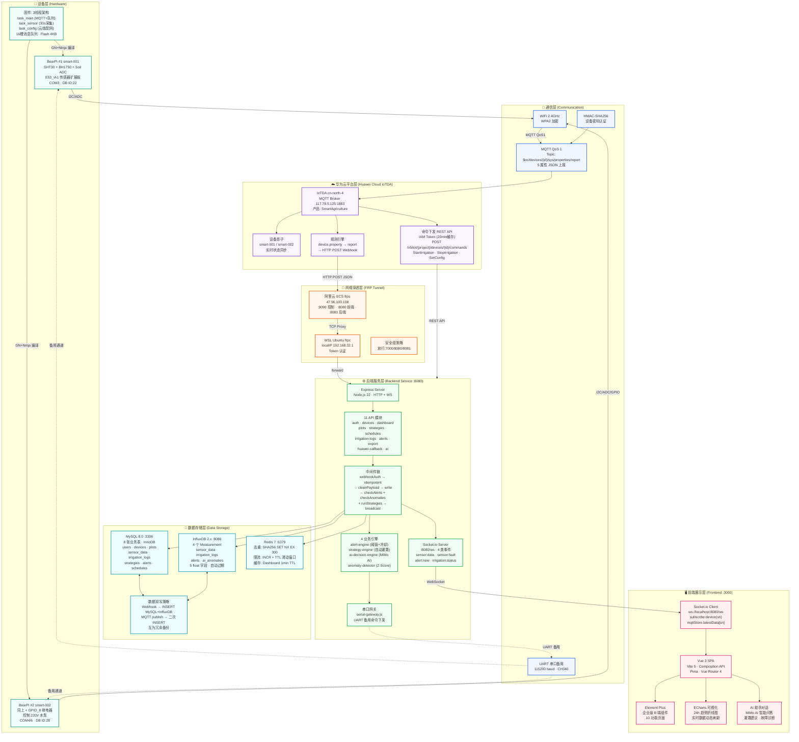
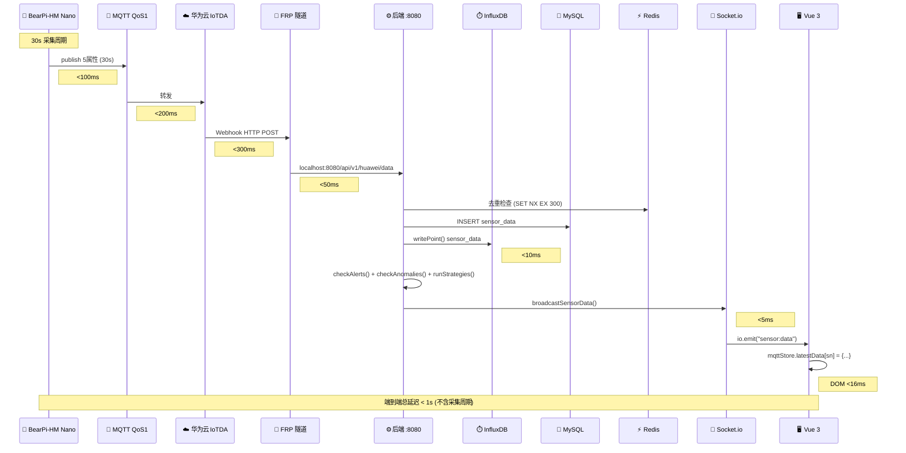
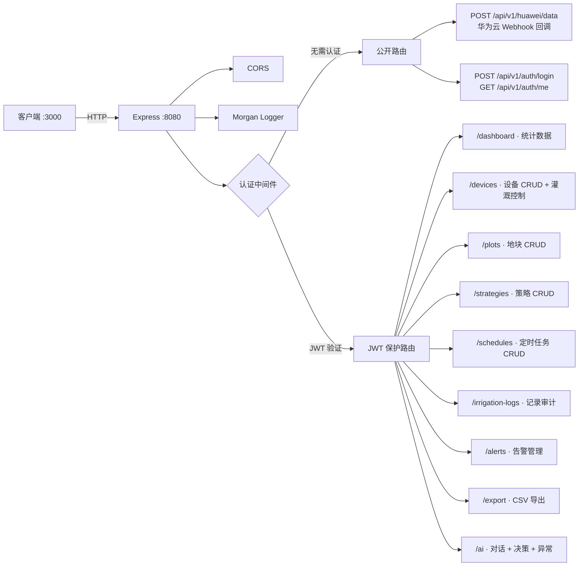
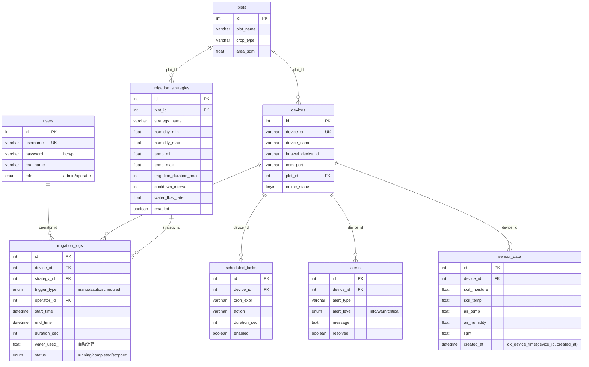
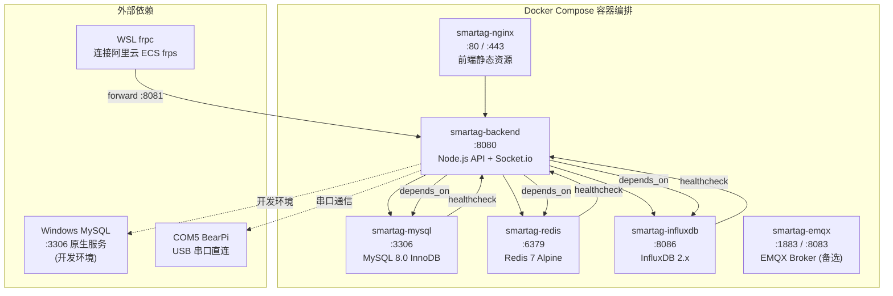
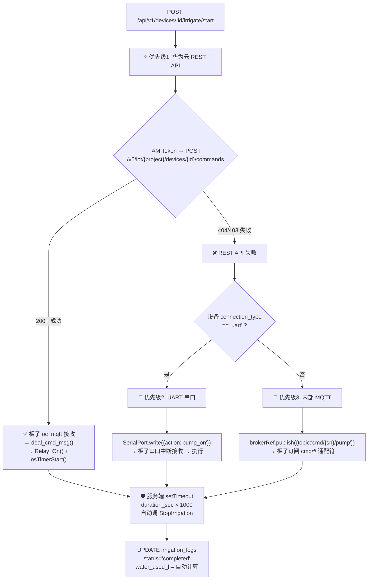
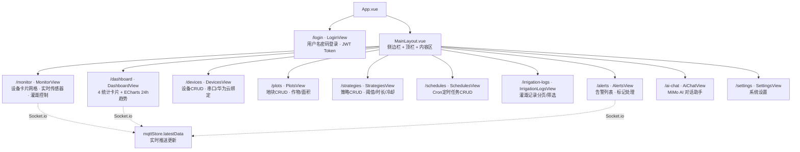

# 智慧农业灌溉系统 — 架构图 (Mermaid)

## 完整系统架构

```mermaid
graph TB
    subgraph DEVICE["🔧 设备层 (Hardware)"]
        direction LR
        B1["BearPi #1 smart-001<br/>SHT30 + BH1750 + Soil ADC<br/>E53_IA1 传感器扩展板<br/>COM3 · DB ID:22"]
        B2["BearPi #2 smart-002<br/>同上 + GPIO_8 继电器<br/>控制 220V 水泵<br/>COM4/6 · DB ID:28"]
        FW["固件: 3线程架构<br/>task_main (MQTT+队列)<br/>task_sensor (30s采集)<br/>task_config (云端配网)<br/>16槽消息队列 · Flash 4KB"]
    end

    subgraph COMM["📶 通信层 (Communication)"]
        direction LR
        WIFI["WiFi 2.4GHz<br/>WPA2 加密"]
        MQTT["MQTT QoS 1<br/>Topic: $oc/devices/{id}/sys/properties/report<br/>5 属性 JSON 上报"]
        AUTH["HMAC-SHA256<br/>设备密码认证"]
        UART["UART 串口备用<br/>115200 baud · CH340"]
    end

    subgraph CLOUD["☁️ 华为云平台层 (Huawei Cloud IoTDA)"]
        direction LR
        IOTDA["IoTDA cn-north-4<br/>MQTT Broker 117.78.5.125:1883<br/>产品: SmartAgriculture"]
        SHADOW["设备影子<br/>smart-001 / smart-002<br/>实时状态同步"]
        RULE["规则引擎<br/>device.property → report<br/>→ HTTP POST Webhook"]
        CMD["命令下发 REST API<br/>IAM Token (20min缓存)<br/>POST /v5/iot/{project}/devices/{id}/commands<br/>StartIrrigation · StopIrrigation · SetConfig"]
    end

    subgraph TUNNEL["🔗 网络穿透层 (FRP Tunnel)"]
        direction LR
        FRPS["阿里云 ECS frps<br/>47.96.100.108<br/>:9090 控制 · :8080 前端 · :8081 后端"]
        FRPC["WSL Ubuntu frpc<br/>localIP 192.168.32.1<br/>Token 认证"]
        SECGRP["安全组策略<br/>放行 7000/8080/8081"]
    end

    subgraph BACKEND["⚙️ 后端服务层 (Backend Service :8080)"]
        direction LR
        EXPRESS["Express Server<br/>Node.js 22 · HTTP + WS"]
        ROUTES["11 API 模块<br/>auth · devices · dashboard<br/>plots · strategies · schedules<br/>irrigation-logs · alerts · export<br/>huawei-callback · ai"]
        MIDDLEWARE["中间件链<br/>webhookAuth → idempotent<br/>→ cleanPayload → write<br/>→ checkAlerts + checkAnomalies<br/>+ runStrategies → broadcast"]
        SOCKETIO["Socket.io Server<br/>:8080/ws · 4 类事件<br/>sensor:data · sensor:fault<br/>alert:new · irrigation:status"]
        ENGINES["4 业务引擎<br/>alert-engine (阈值+冷却)<br/>strategy-engine (自动灌溉)<br/>ai-decision-engine (MiMo AI)<br/>anomaly-detector (Z-Score)"]
        SERIAL["串口网关<br/>serial-gateway.js<br/>UART 备用命令下发"]
    end

    subgraph DATA["💾 数据存储层 (Data Storage)"]
        direction LR
        MYSQL["MySQL 8.0 :3306<br/>8 张业务表 · InnoDB<br/>users · devices · plots<br/>sensor_data · irrigation_logs<br/>strategies · alerts · schedules"]
        INFLUX["InfluxDB 2.x :8086<br/>4 个 Measurement<br/>sensor_data · irrigation_logs<br/>alerts · ai_anomalies<br/>5 float 字段 · 自动过期"]
        REDIS["Redis 7 :6379<br/>去重: SHA256 SET NX EX 300<br/>限流: INCR + TTL 滑动窗口<br/>缓存: Dashboard 1min TTL"]
        DUALWRITE["数据双写策略<br/>Webhook → INSERT MySQL+InfluxDB<br/>MQTT publish → 二次 INSERT<br/>互为冗余备份"]
    end

    subgraph FRONTEND["🖥️ 前端展示层 (Frontend :3000)"]
        direction LR
        VUE["Vue 3 SPA<br/>Vite 5 · Composition API<br/>Pinia · Vue Router 4"]
        UI["Element Plus<br/>企业级 B 端组件<br/>10 功能页面"]
        ECHARTS["ECharts 可视化<br/>24h 趋势折线图<br/>实时数据动态刷新"]
        WS["Socket.io Client<br/>ws://localhost:8080/ws<br/>subscribe:device(sn)<br/>mqttStore.latestData[sn]"]
        AICHAT["AI 助手对话<br/>MiMo AI 智能问答<br/>灌溉建议 · 故障诊断"]
    end

    %% Data Flow
    B1 -->|I2C/ADC| WIFI
    B2 -->|I2C/ADC/GPIO| WIFI
    FW -->|GN+Ninja 编译| B1
    FW -->|GN+Ninja 编译| B2
    WIFI -->|MQTT QoS1| MQTT
    AUTH --> MQTT
    MQTT --> IOTDA
    UART -.->|备用通道| B1
    UART -.->|备用通道| B2
    IOTDA --> SHADOW
    IOTDA --> RULE
    IOTDA --> CMD
    RULE -->|HTTP POST JSON| FRPS
    CMD -->|REST API| BACKEND
    FRPS -->|TCP Proxy| FRPC
    FRPC -->|forward| EXPRESS
    EXPRESS --> ROUTES
    ROUTES --> MIDDLEWARE
    MIDDLEWARE --> SOCKETIO
    MIDDLEWARE --> ENGINES
    ENGINES --> SERIAL
    SERIAL -.->|UART 备用| UART
    MIDDLEWARE --> MYSQL
    MIDDLEWARE --> INFLUX
    MIDDLEWARE --> REDIS
    MYSQL <--> DUALWRITE
    INFLUX <--> DUALWRITE
    SOCKETIO -->|WebSocket| WS
    WS --> VUE
    VUE --> UI
    VUE --> ECHARTS
    VUE --> AICHAT

    %% Styles
    classDef device fill:#F0FDFA,stroke:#0D9488,stroke-width:2px
    classDef comm fill:#EFF6FF,stroke:#2563EB,stroke-width:2px
    classDef cloud fill:#FAF5FF,stroke:#7C3AED,stroke-width:2px
    classDef tunnel fill:#FFF7ED,stroke:#EA580C,stroke-width:2px
    classDef backend fill:#F0FDF4,stroke:#16A34A,stroke-width:2px
    classDef data fill:#ECFEFF,stroke:#0891B2,stroke-width:2px
    classDef frontend fill:#FFF1F2,stroke:#DB2777,stroke-width:2px

    class B1,B2,FW device
    class WIFI,MQTT,AUTH,UART comm
    class IOTDA,SHADOW,RULE,CMD cloud
    class FRPS,FRPC,SECGRP tunnel
    class EXPRESS,ROUTES,MIDDLEWARE,SOCKETIO,ENGINES,SERIAL backend
    class MYSQL,INFLUX,REDIS,DUALWRITE data
    class VUE,UI,ECHARTS,WS,AICHAT frontend
```

## 全链路数据流 (端到端延迟)

```mermaid
sequenceDiagram
    participant Device as 🔧 BearPi-HM Nano
    participant MQTT as 📨 MQTT QoS1
    participant IoTDA as ☁️ 华为云 IoTDA
    participant FRP as 🔗 FRP 隧道
    participant Backend as ⚙️ 后端 :8080
    participant Influx as ⏱️ InfluxDB
    participant MySQL as 🐬 MySQL
    participant Redis as ⚡ Redis
    participant Socket as 🔌 Socket.io
    participant Front as 🖥️ Vue 3

    Note over Device: 30s 采集周期
    Device->>MQTT: publish 5属性 (30s)
    Note right of Device: <100ms
    MQTT->>IoTDA: 转发
    Note right of MQTT: <200ms
    IoTDA->>FRP: Webhook HTTP POST
    Note right of IoTDA: <300ms
    FRP->>Backend: localhost:8080/api/v1/huawei/data
    Note right of FRP: <50ms
    Backend->>Redis: 去重检查 (SET NX EX 300)
    Backend->>MySQL: INSERT sensor_data
    Backend->>Influx: writePoint() sensor_data
    Note right of Influx: <10ms
    Backend->>Backend: checkAlerts() + checkAnomalies() + runStrategies()
    Backend->>Socket: broadcastSensorData()
    Note right of Socket: <5ms
    Socket->>Front: io.emit("sensor:data")
    Front->>Front: mqttStore.latestData[sn] = {...}
    Note right of Front: DOM <16ms

    Note over Device,Front: 端到端总延迟 < 1s (不含采集周期)
```

## API 路由架构

```mermaid
graph LR
    Client[客户端 :3000] -->|HTTP| Express[Express :8080]
    Express --> CORS[CORS]
    Express --> Morgan[Morgan Logger]
    Express --> Auth{认证中间件}

    Auth -->|无需认证| Public[公开路由]
    Auth -->|JWT 验证| Private[JWT 保护路由]

    Public --> HuaweiAPI["POST /api/v1/huawei/data<br/>华为云 Webhook 回调"]
    Public --> LoginAPI["POST /api/v1/auth/login<br/>GET /api/v1/auth/me"]

    Private --> Dashboard["/dashboard · 统计数据"]
    Private --> Devices["/devices · 设备 CRUD + 灌溉控制"]
    Private --> Plots["/plots · 地块 CRUD"]
    Private --> Strategies["/strategies · 策略 CRUD"]
    Private --> Schedules["/schedules · 定时任务 CRUD"]
    Private --> Logs["/irrigation-logs · 记录审计"]
    Private --> Alerts["/alerts · 告警管理"]
    Private --> Export["/export · CSV 导出"]
    Private --> AI["/ai · 对话 + 决策 + 异常"]
```

## 数据库 ER 关系

```mermaid
erDiagram
    users ||--o{ irrigation_logs : "operator_id"
    users {
        int id PK
        varchar username UK
        varchar password "bcrypt"
        varchar real_name
        enum role "admin/operator"
    }
    plots ||--o{ devices : "plot_id"
    plots ||--o{ irrigation_strategies : "plot_id"
    plots {
        int id PK
        varchar plot_name
        varchar crop_type
        float area_sqm
    }
    devices ||--o{ sensor_data : "device_id"
    devices ||--o{ irrigation_logs : "device_id"
    devices ||--o{ alerts : "device_id"
    devices ||--o{ scheduled_tasks : "device_id"
    devices {
        int id PK
        varchar device_sn UK
        varchar device_name
        varchar huawei_device_id
        varchar com_port
        int plot_id FK
        tinyint online_status
    }
    irrigation_strategies ||--o{ irrigation_logs : "strategy_id"
    irrigation_strategies {
        int id PK
        int plot_id FK
        varchar strategy_name
        float humidity_min
        float humidity_max
        float temp_min
        float temp_max
        int irrigation_duration_max
        int cooldown_interval
        float water_flow_rate
        boolean enabled
    }
    sensor_data {
        int id PK
        int device_id FK
        float soil_moisture
        float soil_temp
        float air_temp
        float air_humidity
        float light
        datetime created_at "idx_device_time(device_id, created_at)"
    }
    irrigation_logs {
        int id PK
        int device_id FK
        int strategy_id FK
        enum trigger_type "manual/auto/scheduled"
        int operator_id FK
        datetime start_time
        datetime end_time
        int duration_sec
        float water_used_l "自动计算"
        enum status "running/completed/stopped"
    }
    alerts {
        int id PK
        int device_id FK
        varchar alert_type
        enum alert_level "info/warn/critical"
        text message
        boolean resolved
    }
    scheduled_tasks {
        int id PK
        int device_id FK
        varchar cron_expr
        varchar action
        int duration_sec
        boolean enabled
    }
```

## Docker 容器拓扑

```mermaid
graph TB
    subgraph Docker["Docker Compose 容器编排"]
        direction TB
        NGINX["smartag-nginx<br/>:80 / :443<br/>前端静态资源"]
        BACKEND["smartag-backend<br/>:8080<br/>Node.js API + Socket.io"]
        MYSQL_D["smartag-mysql<br/>:3306<br/>MySQL 8.0 InnoDB"]
        REDIS_D["smartag-redis<br/>:6379<br/>Redis 7 Alpine"]
        INFLUX_D["smartag-influxdb<br/>:8086<br/>InfluxDB 2.x"]
        EMQX["smartag-emqx<br/>:1883 / :8083<br/>EMQX Broker (备选)"]
    end

    subgraph External["外部依赖"]
        WINDOWS["Windows MySQL<br/>:3306 原生服务<br/>(开发环境)"]
        COM["COM5 BearPi<br/>USB 串口直连"]
        FRP_C["WSL frpc<br/>连接阿里云 ECS frps"]
    end

    BACKEND --> MYSQL_D
    BACKEND --> REDIS_D
    BACKEND --> INFLUX_D
    BACKEND -.->|开发环境| WINDOWS
    BACKEND -.->|串口通信| COM
    NGINX --> BACKEND

    MYSQL_D -->|healthcheck| BACKEND
    REDIS_D -->|healthcheck| BACKEND
    INFLUX_D -->|healthcheck| BACKEND

    BACKEND -->|depends_on| MYSQL_D
    BACKEND -->|depends_on| REDIS_D
    BACKEND -->|depends_on| INFLUX_D

    FRP_C -->|forward :8081| BACKEND
```

## 3 级命令下发优先级

```mermaid
flowchart TD
    START["POST /api/v1/devices/:id/irrigate/start"] --> P1

    P1["⭐ 优先级1: 华为云 REST API"]
    P1 --> P1_CHECK{"IAM Token → POST<br/>/v5/iot/{project}/devices/{id}/commands"}
    P1_CHECK -->|200+ 成功| P1_OK["✅ 板子 oc_mqtt 接收<br/>→ deal_cmd_msg()<br/>→ Relay_On() + osTimerStart()"]
    P1_CHECK -->|404/403 失败| P1_FAIL["❌ REST API 失败"]

    P1_OK --> TIMER["🛡️ 服务端 setTimeout<br/>duration_sec × 1000<br/>自动调 StopIrrigation"]
    TIMER --> STOP["UPDATE irrigation_logs<br/>status='completed'<br/>water_used_l = 自动计算"]

    P1_FAIL --> P2_CHECK{"设备 connection_type<br/>== 'uart' ?"}
    P2_CHECK -->|是| P2["🔻 优先级2: UART 串口"]
    P2_CHECK -->|否| P3["🔻 优先级3: 内部 MQTT"]
    P2 --> P2_OK["SerialPort.write({action:'pump_on'})<br/>→ 板子串口中断接收 → 执行"]

    P3 --> P3_OK["brokerRef.publish({topic:'cmd/{sn}/pump'})<br/>→ 板子订阅 cmd/# 通配符"]
    P2_OK --> TIMER
    P3_OK --> TIMER
```

## 前端路由 & 组件树

```mermaid
graph TB
    APP["App.vue"]
    LOGIN["/login · LoginView<br/>用户名密码登录 · JWT Token"]
    MAIN["MainLayout.vue<br/>侧边栏 + 顶栏 + 内容区"]

    APP --> LOGIN
    APP --> MAIN

    MAIN --> DASH["/dashboard · DashboardView<br/>4 统计卡片 + ECharts 24h趋势"]
    MAIN --> MONITOR["/monitor · MonitorView<br/>设备卡片网格 · 实时传感器 · 灌溉控制"]
    MAIN --> DEVICES["/devices · DevicesView<br/>设备CRUD · 串口/华为云绑定"]
    MAIN --> PLOTS["/plots · PlotsView<br/>地块CRUD · 作物/面积"]
    MAIN --> STRATEGIES["/strategies · StrategiesView<br/>策略CRUD · 阈值/时长/冷却"]
    MAIN --> SCHEDULES["/schedules · SchedulesView<br/>Cron定时任务CRUD"]
    MAIN --> LOGS["/irrigation-logs · IrrigationLogsView<br/>灌溉记录分页/筛选"]
    MAIN --> ALERTS["/alerts · AlertsView<br/>告警列表 · 标记处理"]
    MAIN --> AICHAT["/ai-chat · AiChatView<br/>MiMo AI 对话助手"]
    MAIN --> SETTINGS["/settings · SettingsView<br/>系统设置"]

    MONITOR -.->|Socket.io| WS["mqttStore.latestData<br/>实时推送更新"]
    DASH -.->|Socket.io| WS
    ALERTS -.->|Socket.io| WS
```
